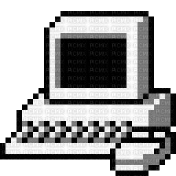

# It's Nymur ! 

#### Developer | Cyber Security Enthusiast | CS Major @uAlberta

#### `Contacts` 
    nymur@vasonite.com

#### `Languages I know ` 

    
    
    
    
    
    
    
    

#### `Technologies`

    
    
    
    
    
    
    
    
    

